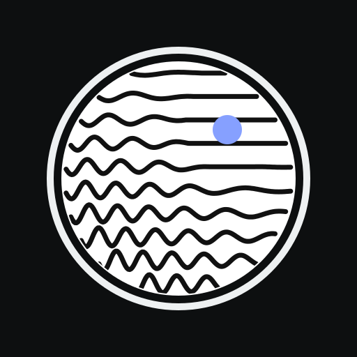

<p align="center"></p>

# terraLens

*Formerly terraPen Camera Plot.*


Point your phone camera at something and turn it into pen-plotter line art in real time, then save an SVG ready for the [terraPen](https://terrapen.xyz) (or any plotter).

**Live page:** https://warderoid-ctrl.github.io/terrapen-camera-plot/

## Use it

1. Open the live page on your phone and tap the shutter button to start the camera. Allow camera access when asked.
2. Swipe the style carousel above the shutter. Each thumbnail previews that style on your picture, and the one in the centre is active (or just tap one). The plot updates as you move the phone.
3. Tap the shutter to freeze the frame, and again to resume.
4. Tap the download button to save the SVG. It's sized in millimetres for the paper you chose.

No camera permission? The camera button beside the shutter opens your camera app instead, and the picture button loads an image from your gallery.

## Install as an app

It's a Progressive Web App, so it installs from the browser with no app store:

- **Android (Chrome):** open the page, then tap **Install** when prompted, or open the settings sheet and tap **Install terraLens**.
- **iPhone / iPad (Safari):** tap **Share**, then **Add to Home Screen**.
- **Desktop (Chrome / Edge):** click the install icon in the address bar.

Once installed it opens full screen, has its own icon, works offline and keeps your settings. Updates arrive automatically the next time it opens with a connection.

## Gestures

| On the picture    | Does                         |
| ----------------- | ---------------------------- |
| Drag left / right | Spacing (levels for Contour) |
| Drag up / down    | Contrast                     |
| Pinch             | Zoom in to check the lines   |
| Double-tap        | Zoom in 3×, or back out      |
| Tap               | Hide or show all controls    |
| Long-press        | Place a focal point; keep holding and drag to move it |

Swipe up on the bottom bar (or tap its handle) for every setting. While you drag a slider, the panel turns see-through so you can watch the full-size plot change.

## Pen colours

Four colour swatches set the colour of pens 1–4. Each pen is its own layer in the SVG, with a matching stroke colour,
so plotter software can pause for a pen change between layers. Duotone always uses pens 1 and 2; the other styles
show the colours when **Show pen colours** is on (Hatch layers, Blobs outline/fill and Technical lineweights are on
separate pens).

## Focal point

Long-press the picture to drop a point that the current style reacts to. A target marker shows while you place or drag it, then fades; turn on **Show target** to keep it visible (it is never in the SVG). The settings sheet has **Attract / Repel**, a **Pull** strength slider and **Remove point**. With no point placed, every style behaves as normal.

| Style   | Attract                                   | Repel                       |
| ------- | ----------------------------------------- | --------------------------- |
| Waves   | Lines pinch in towards the point          | Lines bulge away (lens)     |
| Spiral  | Spiral starts at the point                | same                        |
| Rings   | Rings centre on the point                 | same                        |
| Contour | A hill rises at the point                 | A pit sinks                 |
| Flow    | Whirlpool draining into the point         | Whirl spiralling outward    |
| Blobs   | Hatch radiates, cross adds rings, spiral fill centres on the point | same |
| Hatch   | Lines converge on the point (vanishing point); extra layers add rings | same |
| Stipple | Dots fall towards the point (gravity)     | Dots pushed away            |
| Dots    | Dots sit on rings around the point        | same                        |
| Hairs   | Combed towards the point, like iron filings | Combed into circles around it |
| Arrows  | Aim at the point                          | Aim away                    |
| Suns    | Rays stretch towards the point            | Rays stretch away           |
| Swirls  | Orbit the point, tighter close to it      | Orbit the other way         |
| ASCII   | Characters sit on rings around the point  | same                        |
| Growth  | Grows only around the point; Pull sets how far | same                   |

## Top bar

- **Readout**: paper, total line length, number of lines
- **Flip camera**: front or back (shown while the camera is on)
- **Paper shape**: cycles portrait → landscape → square
- **Source preview**: small thumbnail of what the camera sees, for aiming
- **Full screen**: on browsers that support it

## Styles

| Style   | What it draws                                                                 |
| ------- | ----------------------------------------------------------------------------- |
| Waves   | Horizontal lines whose wave height and frequency follow darkness              |
| Spiral  | One continuous spiral from the centre, wobbling with darkness                 |
| Rings   | Concentric circles, wobbling with darkness                                    |
| Contour | Lines of equal tone, like a map's height lines                                |
| Flow    | Streamlines that follow the edges in the picture                              |
| Blobs   | Smooth shapes from the dark areas, filled with hatch, cross-hatch, contours or a spiral |
| Hatch   | 1–4 layers of cross-hatching; darker areas get more layers                    |
| Technical | Technical drawing: heavy outlines (pen 1), tone lines (pen 2) and section hatching in tonal bands (pen 3), with an optional border frame |
| Duotone | Two-ink print: angled line screens, dark ink (pen 1) for shadows and light ink (pen 2) for highlights and midtones |
| Stipple | Scattered dots, more of them where it's darker                                |
| Dots    | Hexagonal grid of circles sized by darkness                                   |
| Hairs   | Short strokes along the edges                                                 |
| Arrows  | Arrows pointing towards darker areas                                          |
| Suns    | Circles with rays, sized by darkness                                          |
| Swirls  | A small spiral per cell, turned by the image                                  |
| ASCII   | Characters chosen by darkness, drawn as single pen strokes                    |
| Growth  | Reaction-diffusion pattern grown inside the dark areas                        |

Contour, Flow, Stipple, Hairs, Arrows, Suns, Swirls, ASCII and Growth are ported from
[hauntedPoints](https://github.com/warderoid-ctrl/hauntedPoints), where they were driven by
point-cloud displacement. Here darkness takes the place of the data value and the image's
gradient takes the place of the displacement direction.

Blobs puts the outlines on pen 1 and the fill on pen 2, so they can be plotted in two colours.

## Controls

- **Spacing**: distance between lines, rings, dots or grid cells (mm); the label changes with the style
- **Second slider** (wave height, dot size, line length, blob amount…): how strongly darkness drives the style
- **Hatch layers** (Hatch) and **Contour levels** (Contour, 2–200; drag sideways on the picture to double or halve)
- **Spacing** goes down to 0.5 mm for very dense plots; the live preview slows down to keep up
- **Technical options**: heavy outlines (each outline drawn three times, side by side) and a border frame; the second slider sets **Shading**
- **Blob fill** (Blobs): hatch, cross-hatch, contours or spiral
- **Contrast, Brightness, Auto levels, Invert**: tone adjustments before plotting
- **Pen width**: stroke width for the preview and the SVG
- **Paper**: A6 up to A0, each as portrait, landscape or square (square uses the short side, e.g. A4 square is 210 × 210 mm). Changing size scales the line spacing and margin with it, so the drawing keeps its look and the live preview stays fast
- **Margin**: blank border around the drawing (mm)
- **Send SVG**: opens the phone's share sheet (AirDrop, Nearby Share, email) where supported
- **Copy SVG**: copies the SVG markup to the clipboard

## SVG output

- Units are millimetres (`width="210mm"` etc.), so it imports at true size.
- Every stroke is a plain path with no fill, ordered back-and-forth to cut pen-up travel.
- Each pen is its own Inkscape layer with its colour as the stroke, labelled with a leading number (`1 pen 1 #17321b`, `2 pen 2 #e83b68` …) so AxiDraw-style software can plot one layer at a time.
- **Save each pen as its own file** (Export section) saves one SVG per colour instead, for software that ignores layers. Send SVG shares them all together.

## Run locally

It's plain HTML, CSS and JavaScript with no build step or dependencies: `index.html`, plus `manifest.webmanifest`, `sw.js` (offline support) and `icons/`. Browsers only allow camera access over HTTPS or `localhost`, so serve it rather than double-clicking:

```bash
python -m http.server 8000
# then open http://localhost:8000
```

## Publish with GitHub Pages

Settings → Pages → Source: **Deploy from a branch** → Branch: `main`, folder `/ (root)`.

## Credits

Inspired by [mitxela/plotterfun](https://github.com/mitxela/plotterfun). Built for [terraPen](https://terrapen.xyz).

## License

MIT. See [LICENSE](LICENSE).
